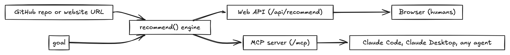

# Repo Recommender

Point it at a GitHub repo or a website and say what you want next ("auth solution", "background jobs"),
and it returns repos that genuinely complement yours, each with a short reason it fits and quick ratings.

Live at reporecommender.com (coming soon). Built in the open with Claude Code.

## Why this repo exists

Two things at once:

1. A real, useful tool that extends [RepoRadar.io](https://reporadar.io) (2nd of 302 at the
   Generative UI Global Hackathon).
2. A teaching artifact. Every major Claude Code feature used to build it is written up in
   [`lessons/`](./lessons), so the repo doubles as a hands-on course in building with Claude Code the
   disciplined way, not vibe coding.

## How it works: one engine, two surfaces



The recommendation logic lives once, in `src/engine.ts` (`recommend(repoUrl, goal)`). It is exposed
through two surfaces:

- A **Web API** (`/api/recommend`) for the website. Browsers speak HTTP.
- Our own **MCP server** (`recommend_repos` tool) so Claude Code, Claude Desktop, or any agent can
  call the same capability. We build an MCP server here, not just consume one.

The caller decides the interface: software uses the API, agents use MCP.

The request flow, end to end:


## Stack

Cloudflare Worker with Static Assets (the `public/` frontend) plus D1, and the Claude API for
analysis and ranking (Haiku to extract, Sonnet to reason). TypeScript, no frontend framework.

## Local development

```bash
npm install
bash scripts/set-dev-vars.sh   # securely set ANTHROPIC_API_KEY and GITHUB_TOKEN (hidden input)
npm run dev                     # http://localhost:8787
```

## The lesson book

A two-week curriculum that teaches Claude Code through the real build. Lessons are written as the
features get used. Index below; more land as the build proceeds.

**Before we build:** [what we built and what we are building](./lessons/01-what-we-built.md); the
Claude toolkit and product map;
[PRD and plan mode](./lessons/03-prd-and-plan-mode.md); permissions and safe autonomy.

**Build it:** Cloudflare step zero; [`claude init` and CLAUDE.md](./lessons/06-claude-init-and-claude-md.md);
[custom skills](./lessons/07-custom-skills.md); [integrations and MCP](./lessons/08-integrations-and-mcp.md);
context window management;
[model tiering](./lessons/10-model-tiering-and-cost.md) with tokens, pricing, and
latency; subagents; [hooks](./lessons/12-hooks.md); [git and worktrees](./lessons/13-git-and-worktrees.md);
[secrets and key management](./lessons/14-secrets-and-keys.md).

**Team and quality:** working with others; [debugging](./lessons/16-debugging.md);
[owning your tests](./lessons/17-tests.md); [running evals](./lessons/18-evals.md);
[deploy](./lessons/19-deploy.md).

## Built with Claude Code

This repo is a disciplined build: plan mode, a `CLAUDE.md` that steers the work, custom skills, a
quality and safety hook that blocks secrets and style slips at commit time, and small atomic commits
you can read top to bottom.
