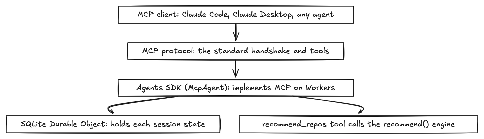

# Lesson 8: integrations and MCP




**What it is.** MCP (Model Context Protocol) is Anthropic's open standard for connecting AI models to
tools and data. An MCP *server* exposes tools. An MCP *client* (Claude Code, Claude Desktop, Cursor,
ChatGPT connectors) calls them. It is the universal adapter, the USB-C for AI tools: build one server,
and any MCP client can use it.

The line that matters: **MCP is for agent callers. Software callers use a normal API.** A browser
cannot speak MCP, so the website talks to an HTTP API. An agent speaks MCP, so it calls the MCP server.
Same capability, two front doors.

**How we used it here.** We exposed the recommendation engine as our own MCP server (`src/mcp.ts`)
with one tool, `recommend_repos`. It is the same `recommend()` engine the website uses. Three layers
made it work, and they are worth separating because they confuse people:

- **MCP** is the protocol (the wire format, the handshake, the session model).
- **The Agents SDK (`McpAgent`)** implements that protocol on Cloudflare Workers, so we wrote only
  the tool (about fifteen lines) and the SDK handled the `initialize` handshake, sessions, and the
  Streamable HTTP (`/mcp`) and SSE (`/sse`) transports.
- **A SQLite Durable Object** is where each MCP session's state lives. MCP is stateful: a client
  initializes a session, then makes several calls within it. On Cloudflare, per-session state belongs
  in a Durable Object, and modern Durable Objects store data in SQLite. The SDK uses it for you. That
  is what the `durable_objects` binding and the `new_sqlite_classes` migration in `wrangler.jsonc` are
  for. You never write SQL.

**Why it matters.** It turns your capability into a tool any agent can use, with no website visit.
Build once, callable from every MCP client. Building a server, not just consuming one, is the strong
signal: you published a tool, you did not just use someone else's.

**How to use it (consume our server).**

```bash
claude mcp add --transport http reporecommender https://reporecommender.com/mcp
```

Then start a Claude Code session and ask it to recommend repos. It calls the tool. In Claude Desktop,
add the same URL under Connectors.

**Gotchas.**

- MCP servers load at **session start**. Add the server, then start (or restart) the session, or the
  client will not see the new tool.
- Do not confuse the two sides. The agent reaches our app over MCP. Our app reaches GitHub over a
  plain REST call, not MCP. MCP is how the agent gets tools, not how every service talks to every
  other service.
- On Workers you need `nodejs_compat`, the Durable Object binding, and the migration. Miss any one and
  the deploy fails.
