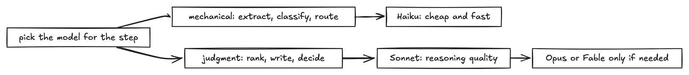

# Lesson 10: model tiering, tokens, pricing, and latency

**What it is.** Not every step needs your most capable model. Match the model to the job: a cheap,
fast model for mechanical work (extract, classify, route) and a stronger model for judgment (rank,
write, decide). This is the single biggest lever on cost and latency in an LLM app.

**How we used it here.** The engine makes two model calls per request, on two tiers, set in
`src/claude.ts`:

- **Haiku** reads the repo or website and extracts its purpose, stack, and a few search queries.
  High volume, mechanical, invisible plumbing. Haiku is plenty.
- **Sonnet** ranks the candidates and writes the per-repo What, Why, and How plus the ratings. This
  is reasoning and user-facing prose, so it earns the stronger model.

**Why.** Cost and latency. Haiku is a fraction of Sonnet's price and noticeably faster. Running the
extraction step on Sonnet would cost more and add latency for no quality gain a user would ever see.
This is exactly the token-economics conversation an enterprise has before rolling Claude out to
thousands of seats: where does a bigger model actually change the answer, and where is it just a
bigger bill?

**Result.** Each recommendation is two tiered calls. The extraction stays cheap and quick, the
rationale stays high quality. We left a comment at the model choices so the cost story is legible to
the next reader.

**How to use it.**

1. List the steps in your pipeline.
2. Mark each as mechanical (classify, extract, route) or judgment (rank, write, decide).
3. Put mechanical steps on Haiku, judgment steps on Sonnet.
4. Escalate to Opus or Fable only when Sonnet visibly struggles, and note why in a comment.

**Gotchas.**

- Do not default everything to the biggest model "to be safe." That is how token bills explode.
- Do not put quality-sensitive, user-facing prose on the cheapest model. Measure before assuming.
- Prompt caching and batching cut cost further on repeated or high-volume calls. Reach for them once
  the tiering is right.
